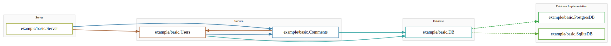
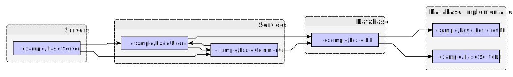

# ArchView

ArchView is a tool for creating and inspecting Go program architecture based on annotations.

## Introduction

To start using, add annotations like so:

```
// architecture: Database
type DB interface {
	Query() string
}

// architecture: Service
type Users struct {
	db       *DB
	comments *Comments
}

// architecture: Service
type Comments struct {
	db    *DB
	users *Users
}

// architecture: Server
type Server struct {
	comments *Comments
	users    *Users
}

// we can create links between interfaces and implementations with idiomatic Go
var _ DB = &PostgresDB{}
var _ DB = (*SqliteDB)(nil)

// architecture: Database Implementation
type PostgresDB struct{}

// architecture: Database Implementation
type SqliteDB struct{}
```

When we run the tool to output a graphviz `dot` file:

```
archview ./... | dot -Tsvg > graph.svg
```



We can also use more complicated tools, by outputting a graphml file:

```
archview -out example.graphml ./... 
```

With a tool like [yEd](https://yed.yworks.com) we can try different ways of visualizing:



## Tools

To install archview run:

```
go get -u github.com/storj/archview
```

You'll also need a tool to layout the graph, for example:

1. [GraphViz](https://www.graphviz.org/) for `dot` formats.
2. [yEd](https://yed.yworks.com) for `graphml` formats.

Running the tool outputs the graph definition:

```
archview [-format (dot|dot-basic|graphml)] [-out <output file>] [packages]
```